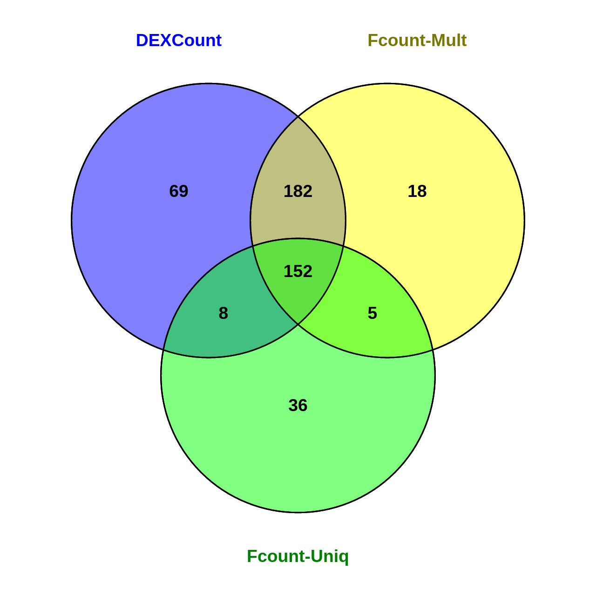

# Subread_to_DEXSeq
Vivek Bhardwaj  
16.10.2015  

## These functions provide a way to use featurecounts output for DEXSeq

The directory contains three scripts:

1) **dexseq_prepare_annotation2.py** : It's same as the "dexseq_prepare_annotation.py" that comes with DEXSeq, but with an added option to output featureCounts-readable GTF file.

2) **Convert_SubreadOutput.R** : It's an Rscript to format featureCounts output file so that It looks like DEXSeq-counts output (with exon-IDs included).

3) **load_SubreadOutput.R** : Provided a function "DEXSeqDataSetFromFeatureCounts", to load the output of "Convert_SubreadOutput.R" as a dexSeq object.

## Usage example

**1) Prepare annotation**


```bash
python dexseq_prepare_annotation2.py -f dm6_ens76_flat.gtf dm6_ens76.gtf dm6_ens76_flat.gff
```

you will get a file "dm6_ens76_flat.gff" and another "dm6_ens76_flat.gtf" (for featurecounts)

**2) Count using Subread (command line)**

We use the **-f** options to count reads overlapping features.

We can use the **-O** option to count the reads overlapping to multiple exons (similar to DEXSeq_count).

The feature-type (**-t** option) is called **exonic_part**.


```bash
/path/to/subread/bin/featureCounts -f -O -s 2 -p -T 40 -F GTF -t exonic_part -a dm6_ens76_flat.gtf -o dm6_fCount.out Cont_1.bam Cont_2.bam Test_1.bam Test_2.bam

```

**3) Convert format**

*These scripts require dplyr, argparser, and DEXSeq installed in your R..* We can use **-t** option to use multiple threads. 

On command line, do:


```bash
Rscript Convert_SubreadOutput.R -t 20 -f dm6_fCount.out -n "Cont_1,Cont_2,Test_1,Test_2" -o dex-like-output.out
```

**4) load into DEXSeq**

In R do:


```r
source("load_SubreadOutput.R")
samp <- data.frame(row.names = c("cont_1","cont_2","test_1","test_2"), condition = rep(c("control","trt"),each=2))
dxd.fc <- DEXSeqDataSetFromFeatureCounts("dex-like-output.out",
                                         flattenedfile = "dm6_ens76_flat.gtf",sampleData = samp)
```

## Results

On a real dataset from drosophila (mapped to dm6). I compared the output from featurecounts (two modes) and DEXSeq_Counts.

In **unique** mode, fragments overlapping multiple features are not counted, while in **multi** mode, they are counted.

#### Dispersion Estimates


#### Results

**Number of differentially expressed exons with 10% FDR**. The output from featurecounts is highly similar to DEXSeq_Count, when we count the multi-feature overlapping reads **(-O option)**. 




