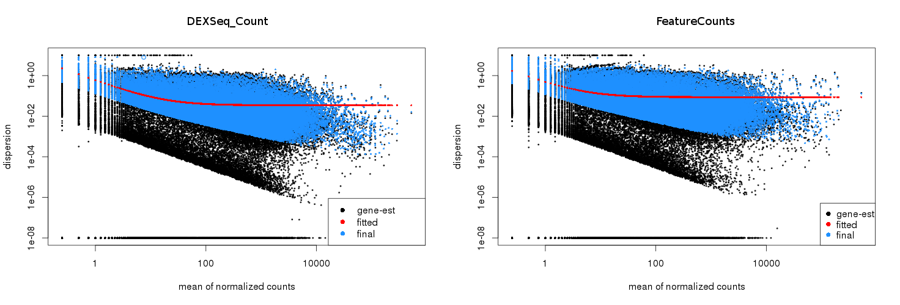
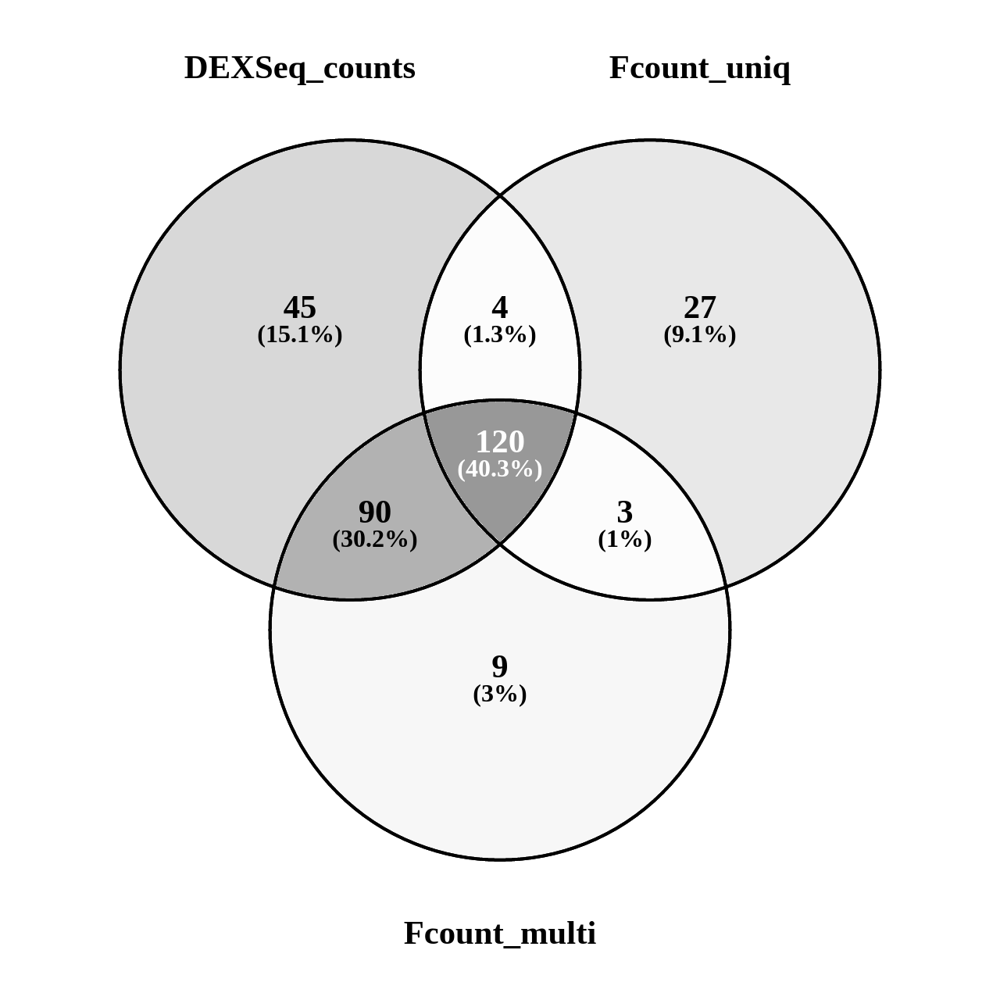

# Subread_to_DEXSeq
Vivek Bhardwaj  

## These functions provide a way to use featurecounts output for DEXSeq

The directory contains two scripts:

1) **dexseq_prepare_annotation2.py** : It's same as the "dexseq_prepare_annotation.py" that comes with DEXSeq, but with an added option to output featureCounts-readable GTF file.

2) **load_SubreadOutput.R** : Provides a function "DEXSeqDataSetFromFeatureCounts", to load the output of featureCounts as a dexSeq dataset (dxd) object.

## Usage example

**1) Prepare annotation**

Syntax :

```bash
python dexseq_prepare_annotation2.py -f <featurecounts.gtf> <input.gtf> <dexseq_counts.gff>
```

Example :

```bash
python dexseq_prepare_annotation2.py -f dm6_ens76_flat.gtf dm6_ens76.gtf dm6_ens76_flat.gff
```

you will get a file "dm6_ens76_flat.gff" and another "dm6_ens76_flat.gtf" (for featurecounts)

**2) Count using Subread (command line)**

We use the **-f** options to count reads overlapping features.

We can use the **-O** option to count the reads overlapping to multiple exons (similar to DEXSeq_count).


```bash
/path/to/subread/bin/featureCounts -f -O -s 2 -p -T 40 \
-F GTF -a dm6_ens76_flat.gtf \
-o dm6_fCount.out Cont_1.bam Cont_2.bam Test_1.bam Test_2.bam

```

**3) load into DEXSeq****

*This script requires dplyr, and DEXSeq installed in your R..*

In R prepare a sampleData data.frame, which contains sample names used for featurecounts as rownames, plus condition, and other variables you want to use for DEXSeq design matrix.

Example :

```r
source("load_SubreadOutput.R")
samp <- data.frame(row.names = c("cont_1","cont_2","test_1","test_2"), 
                        condition = rep(c("control","trt"),each=2))
dxd.fc <- DEXSeqDataSetFromFeatureCounts("dm6_fCount.out",
                                         flattenedfile = "dm6_ens76_flat.gtf",sampleData = samp)
```

This will create a **dxd** object that you can use for DEXSeq analysis.

## Results

On a real dataset from drosophila (mapped to dm6). I compared the output from featurecounts (two modes) and DEXSeq_Counts.

In **unique** mode, fragments overlapping multiple features are not counted, while in **multi** mode, they are counted.

#### Dispersion Estimates



#### Results

**Number of differentially expressed exons with 10% FDR**. The output from featurecounts is highly similar to DEXSeq_Count, when we count the multi-feature overlapping reads **(-O option)**.



